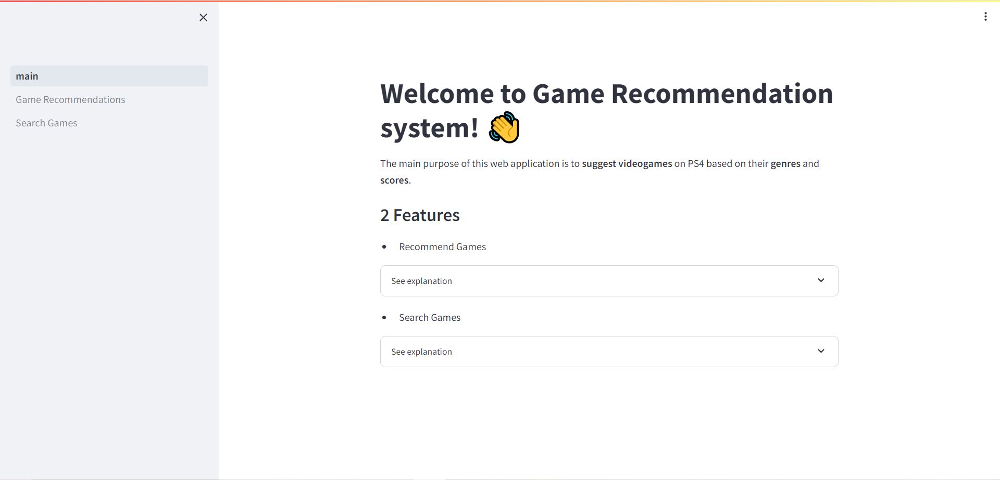
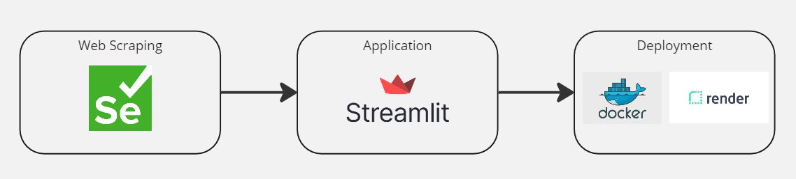

# Games Recommendation System for PS4

This application is running on **Render**: https://games-recommendation-system.onrender.com

The **mainpage** of this app looks like the image below !

**Note**: The app might not be working as there is a usage limit for Free tier on **Render**.

## Goals

- **Develop a Recommendation System:** Create an application that suggests similar PS4 games based on the one you choose. 

- **Skill Acquisition:** Acquire essential skills for Data Scientist / Data Engineer / Data Analyst role.

    - **Web Scraping:** Extracting data from a website to gather information on videogames (from https://whatoplay.com/ps4/best/)

    - **Docker:** Containerizing the application to make the deployment easier on Render.

    - **Streamlit**: Developing a user-friendly interface using Streamlit to display the recommendation results

    

## Structure and flow

This project consists of 3 main parts:

- **Web Scraping**: Collect data on video games including: the name of videogames, release dates, genres and scores. 

- **Application**: Build a user-friendly interface using Streamlit to show the result. The application will allow users to select a game and view similar game suggestions based on the scraped data.

- **Deployment**: Deploying the Streamlit application for easy access and use.

## Results and improvements

- The recommendation system is working as expected, but the genres should be further cleaned to maintain consistency. For example, there are games categorized as 'JRPG' and 'RPG'. In reality, 'JRPG' is a subset of 'RPG' and should not be considered a separate category.

- This system suggests similar games based only on their genres.  It would be a more accurate application if title and release dates were included as parameters.

